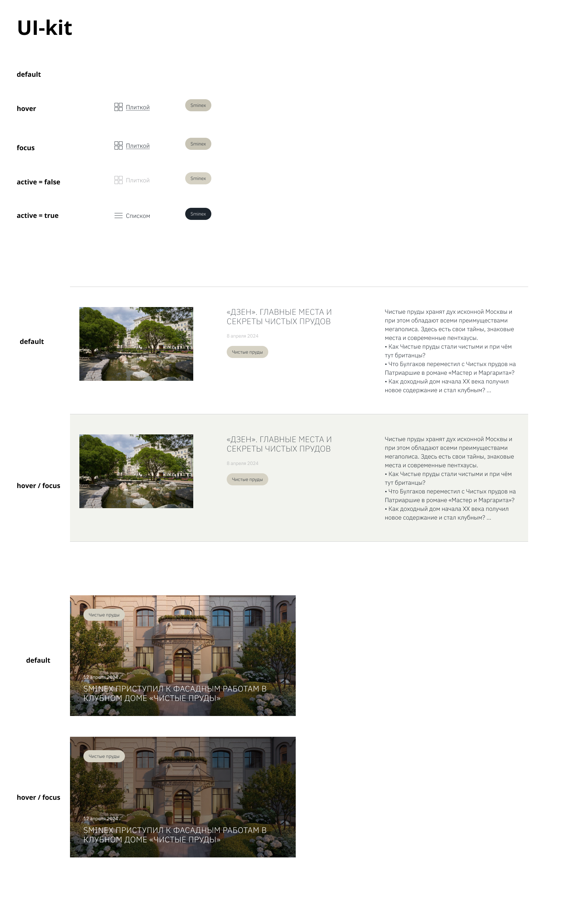
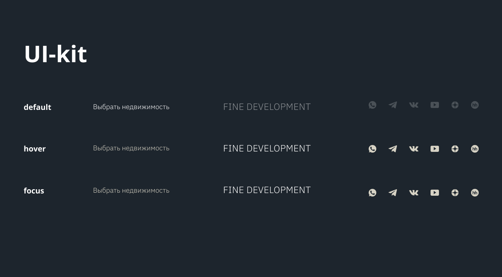
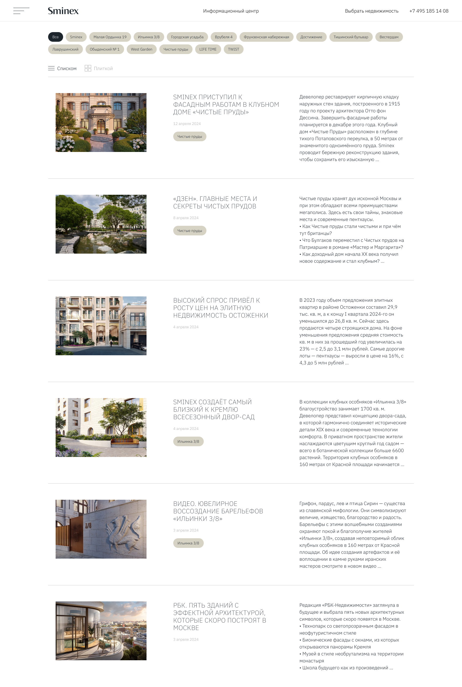
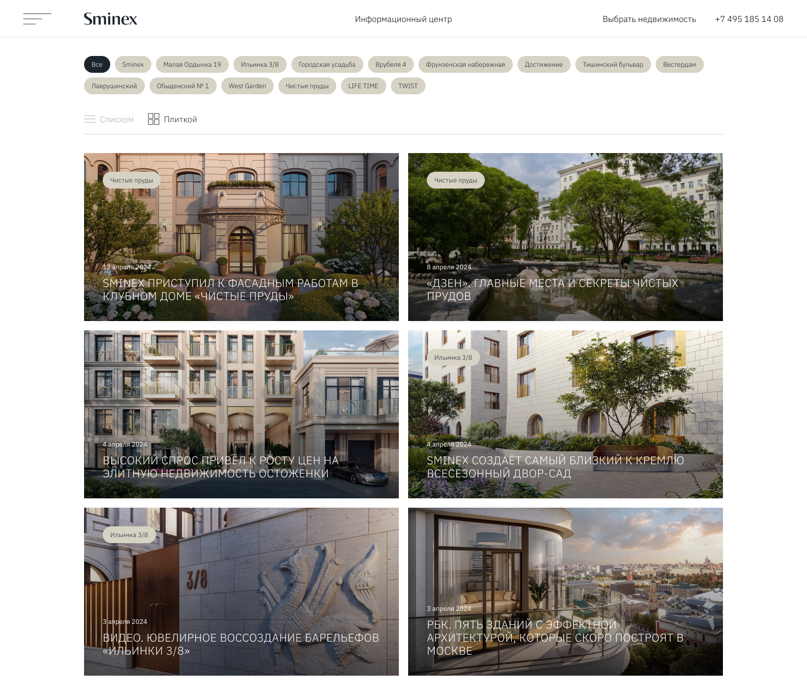
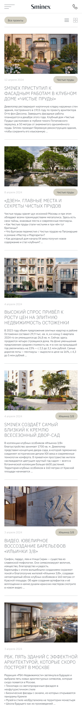
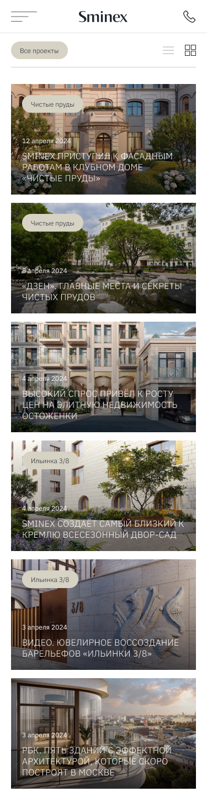
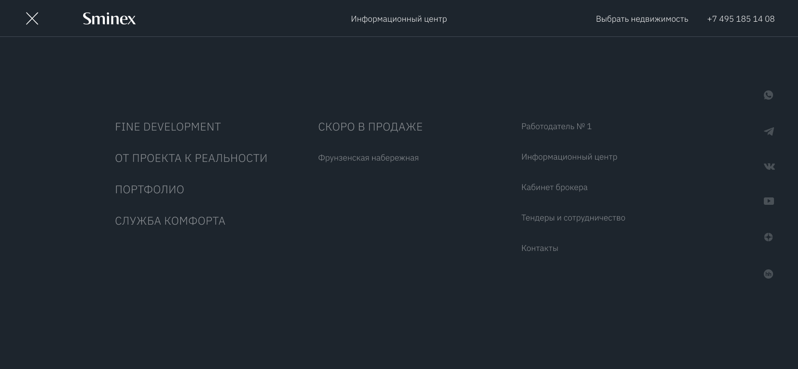
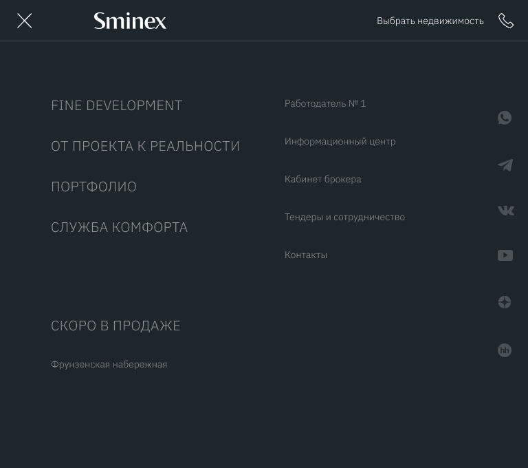
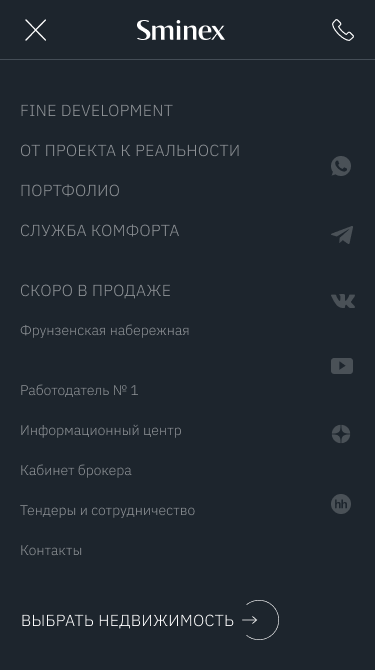

<h1>Create a rubber adaptive layout of the information center page and burger menu for the Sminex-Inteco company website, based on the design from the provided layout in Figma. :ok_hand: </h1>
<ul>
  <li>A rubber layout was used to correctly display the page at any width from 360 to 4,000 pixels.</li>
  <li>The layout is adapted to all resolutions and is based on the layout.</li>
  <li>Raster images prepared for screens with image backlighting, 2x.</li>
  <li>Images are connected taking into account their adaptation.</li>
  <li>Styling is done using the Sass preprocessor.</li>
  <li>Font families and colors are converted to SCSS variables.</li>
  <li>All state elements from the user interface are generated.</li>
  <li>With insufficient height, the main indicator of the page footer is pressed against the low screen (screenshot).</li>
  <li>Form fields are inside the <form> tag.</li>
  <li>Mandatory fields have a mandatory attribute.</li>
  <li>It was possible to avoid excessive increase in the selector weight (error example).</li>
  <li>The area of ​​​​interaction with the interactive component is advantageous and sufficient.</li>
  <li>Interactive ones have visual response elements when focusing with keyboards.</li>
  <li>Positioned graphic elements have clickability disabled (pointer-events: none;).</li>
  <li>Vector images are added to the sprite.</li>
  <li>The form fields have name and id attributes, the radio button has a value.</li>
  <li>The layout corresponds to the layout, the last check was done by Pixel Perfect (error - 10 px).</li>
  <li>Grids are created using Flex or Grid technologies.</li>
  <li>All interactive elements have an explicit or hidden text signature.</li>
  <li>A hidden title has been added if there is no suitable title in the layout.</li>
  <li>The button has a required attribute type filled in correctly.</li>
  <li>The main important pages should not be outside the sections</li>
  <li>All content inside the main tag is located in the "section" tags.</li>
  <li>When approaching a section, the horizontal center point relative to the edges of the page shows the toilet class counter "div class="container""</li>
  <li>The layout is done according to the layout.</li>
  <li>The logic of the project file structure is observed.</li>
  <li>The code is formatted.</li>
  <li>The layout was created using BEM.</li>
  <li>The markup is formed according to the semantics.</li>
  <li>The layout has been checked for validity (HTML validator, BEM validator).</li>
  <li>When transferring the layout text, the typographer processed it.</li>
  <li>The graphic is selected in the following format: JPG, PNG or SVG.</li>
  <li>All links have the # value for the href attribute.</li>
  <li>The layout has been checked when refilling the content (example of errors).</li>
</ul>

<h2 align="center">UI-KIT :art:</h2>

  

<h2 align="center">UI-KIT BURGER :art::hamburger:</h2>

  

<h2 align="center">Desktop - 1728 :desktop_computer:</h2>

  

<h2 align="center">Desktop-GRID - 1728 :desktop_computer:</h2>

  

<h2 align="center">Mobile - 375  :vibration_mode:</h2>

  

<h2 align="center">Mobile-GRID - 375  :vibration_mode:</h2>

  

<h2 align="center">Burger-Desktop 1728 :hamburger:</h2>

  

<h2 align="center">Burger-Tablet 1728 :hamburger:</h2>

  

<h2 align="center">Burger-Mobile - 375 :hamburger:</h2>

  

